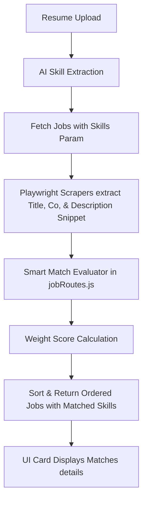

# Description-First Smart Matching Recommendation Engine

This documentation outlines the design and implementation of the description-first matching engine, which aligns job recommendations based on skills, domain, responsibilities, and technologies rather than basic job title matching.

## Scoring Model Weights
The intelligent matching score computes relevance using a weighted formula:
1. **Job Description Relevance (45%)**
   - Matches candidate's domain keywords against description content.
2. **Skills Overlap (30%)**
   - Matches candidate skills extracted from the resume against the job description and title using safe word boundary regular expressions.
3. **Domain Similarity (15%)**
   - Resolves candidate and job domains to identify alignment. Grants a 65% partial match score for related domains (e.g., GRC candidate matching Cybersecurity or Cloud Security) to support cross-domain opportunities.
4. **Job Title Match (10%)**
   - Lexical overlap check between search query words and job titles.

---

## Technical Flow

## Related Domains Map
To enable intelligent cross-domain discoverability, we cluster related domains:
- **Security**: Cybersecurity, GRC, Cloud
- **Development**: Frontend, Backend, DevOps, Cloud
- **Data & AI**: AI/ML, Data Analyst
- **Infrastructure**: Networking, DevOps, Cloud

---

## Frontend Integration
- **API Requests**: Appended `&skills=...` parameter during platform clicks/search submits.
- **Why this matches Card section**: Displays description snippets and highlights up to 4 exact matched technology keywords with custom styled badges under a visual "Matched because" indicator.
